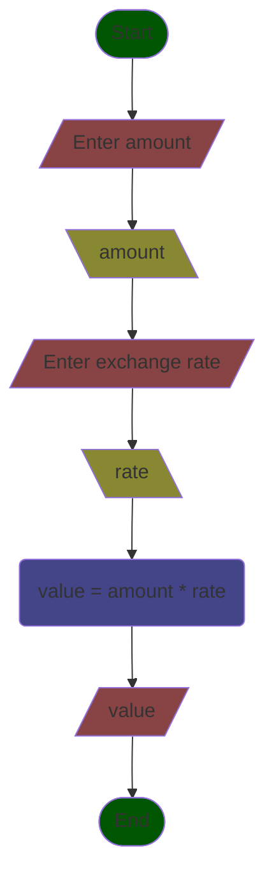

# Currency conversion

```mermaid
flowchart TD
    A([Start]):::round --> B[/Enter amount/]:::output
    B --> C[\amount\]:::input
    C --> D[/Enter exchange rate/]:::output
    D --> E[\rate\]:::input
    E --> F(value = amount * rate):::action
    F --> G[/value/]:::output
    G --> H([End]):::round

    classDef round fill:#050
    classDef input fill:#883
    classDef output fill:#844
    classDef action fill:#448
```