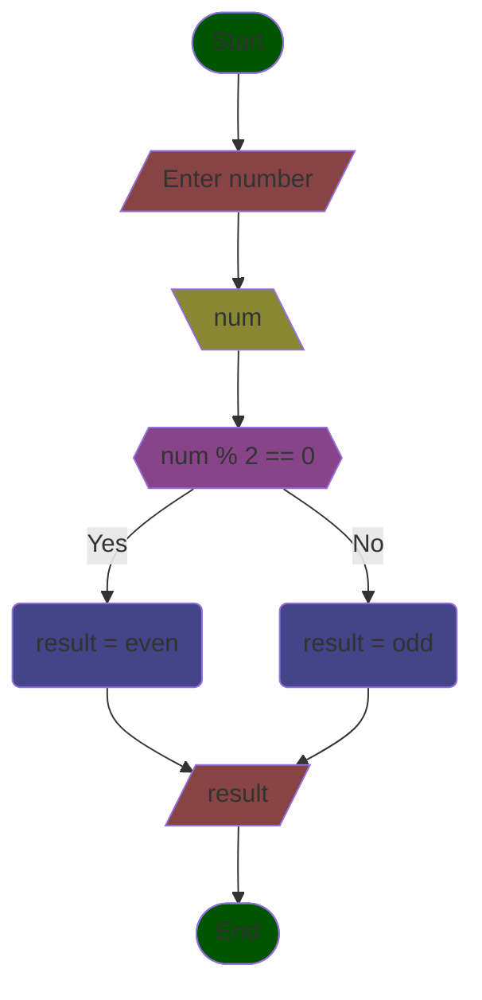

# Even or odd number

```mermaid
flowchart TD
    A([Start]):::round --> B[/Enter number/]:::output
    B --> C[\num\]:::input
    C --> D{{num % 2 == 0}}:::decision
    D --> |Yes| E(result = even):::action
    D --> |No| F(result = odd):::action
    E --> G[/result/]:::output
    F --> G
    G --> H([End]):::round

    classDef round fill:#050
    classDef input fill:#883
    classDef output fill:#844
    classDef action fill:#448
    classDef decision  fill:#848
```